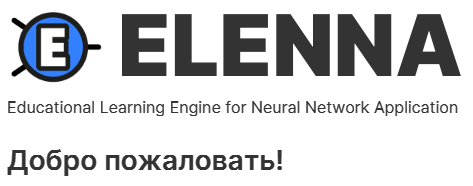
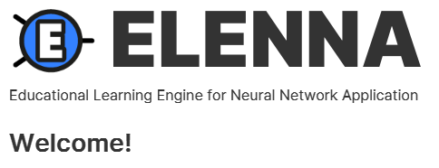
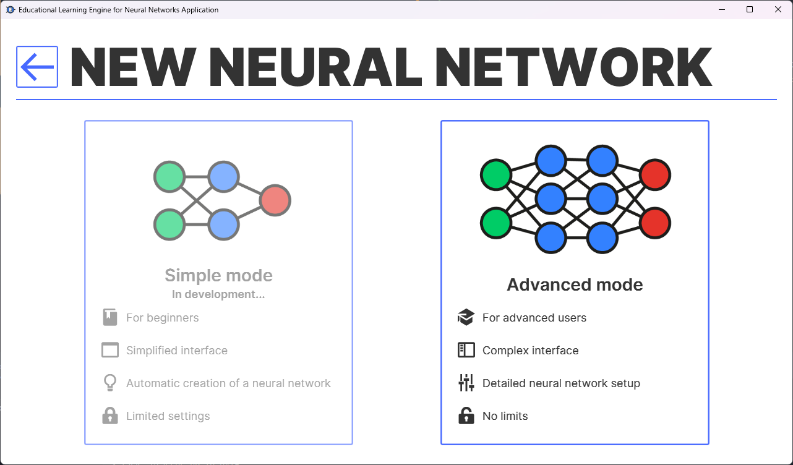
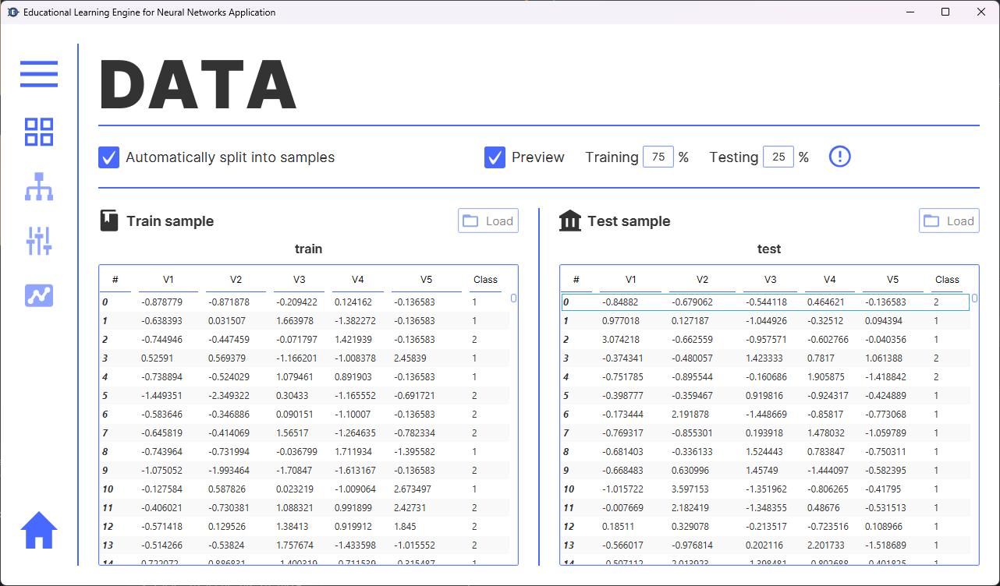
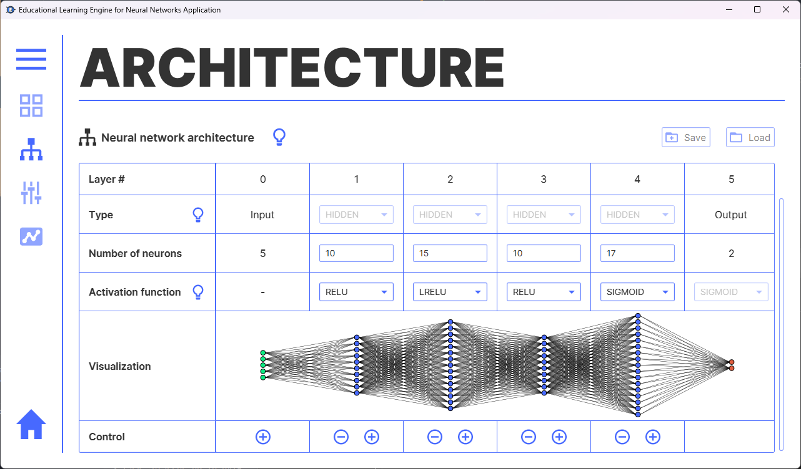
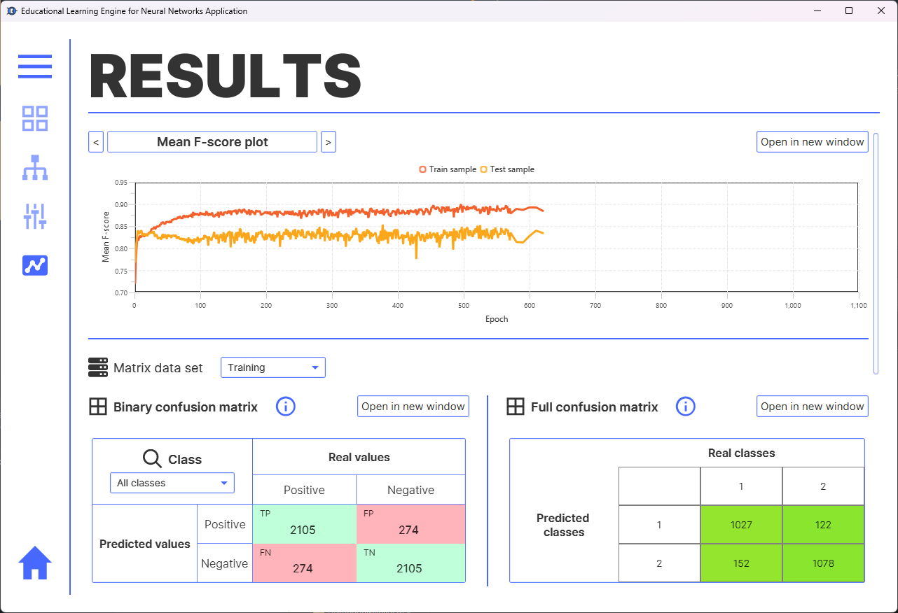
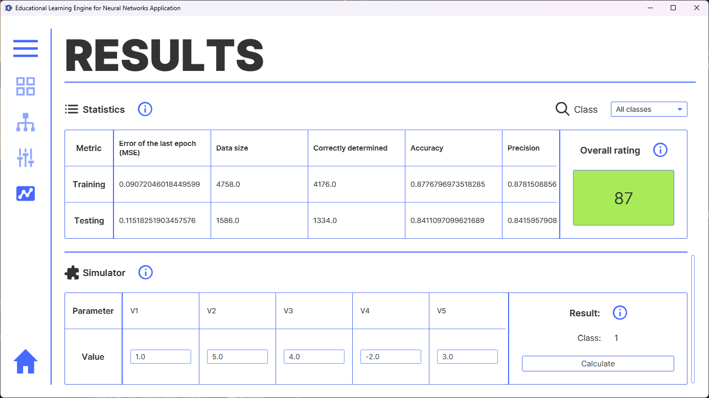

Table Of Contents

<!-- TOC -->
* [Русский](#русский)
  * [Платформа ANNA/ELENNA](#платформа-annaelenna)
  * [Краткое руководство пользования редактором](#краткое-руководство-пользования-редактором)
    * [Простой режим](#простой-режим)
    * [Продвинутый режим](#продвинутый-режим)
* [English](#english)
  * [ANNA/ELENNA Platform](#annaelenna-platform)
  * [Quick start guide to using the editor](#quick-start-guide-to-using-the-editor)
    * [Simple mode](#simple-mode)
    * [Advanced mode](#advanced-mode)
* [Screenshots](#screenshots)
<!-- TOC -->

# Русский

## Платформа ANNA/ELENNA
**Платформа ELENNA** (_Educational Learning Engine for Neural Network Application_) -- это приложение, позволяющее создавать, настраивать и обучать свои нейронные сети для решения задач классификации и прогнозирования (в разработке).

**На данный момент вмещает в себя большую часть задуманного функционала, в том числе:**
- Загрузка обучающих/тестовых данных;
- Настройка архитектуры нейронной сети;
- Настройка гиперпараметров;
- Оценивание работы нейронной сети по обеим выборкам;
- Графики и матрица ошибок;
- Информация и краткое руководство.

_При обнаружении ошибок, просьба сообщать в [форме обратной связи](https://forms.yandex.ru/u/6443d915d046880af1ef091f/)._

## Краткое руководство пользования редактором

### Простой режим
*В разработке...*

### Продвинутый режим
1. Загрузить набор данных в формате *.csv* (подробнее об структуре данных можно посмотреть в подсказках);
2. Вкладка **"Архитектура"**
   * Если набор данных **не приведен** в нужную структуру, необходимо настроить входной слой вручную;
   * Добавить необходимое количество слоев и нейронов, выбрать функции активации;
3. Вкладка **"Управление"**
   * *(Опционально)* Настроить гиперпараметры под решаемую задачу;
   * Нажать кнопку **"Начать обучение сети"**;
4. Поздравляем! Вы обучили нейронную сеть!

***Автор:***
***Алексей "ravik" Близниченко.***

---

# English

## ANNA/ELENNA Platform
**ELENNA Platform** (_Educational Learning Engine for Neural Network Application_) is an application that allows you to create, configure and train your neural networks to solve classification and prediction problems (in development).

**Currently, it contains most of the intended functionality, including:**
- Loading training/test data;
- Setting up the neural network architecture;
- Setting up hyperparameters;
- Assessing the performance of the neural network on both samples;
- Graphs and error matrix;
- Information and quick guide.

_If you find any errors, please report them in the [feedback form](https://forms.yandex.ru/u/6443d915d046880af1ef091f/)._

## Quick start guide to using the editor

### Simple mode
*Under development...*

### Advanced mode
1. Load the dataset in *.csv* format (more details about the data structure can be found in the tips);
2. Tab **"Architecture"**
    * If the data set is **not configured** to the desired structure, you must configure the input layer manually;
    * Add the required number of layers and neurons, select activation functions;
3. Tab **"Management"**
    * *(Optional)* Configure hyperparameters;
    * Click the button **"Start network training"**;
4. Congratulations! You have trained a neural network!

***Author:***
***Aleksei "ravik" Bliznichenko.***

---

# Screenshots

